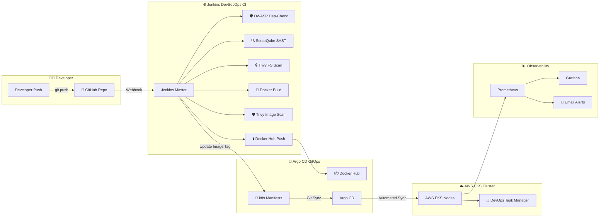

# Production DevSecOps & GitOps Mega Project

[](https://aws.amazon.com/)
[](https://www.terraform.io/)
[](https://www.jenkins.io/)
[](https://argoproj.github.io/cd/)
[](https://owasp.org/)
[](https://grafana.com/)

A comprehensive, production-grade **DevSecOps + GitOps Mega Project** designed from scratch. Features an interactive **DevOps Task Manager** full-stack application (React.js, Node.js/Express, MongoDB), fully automated AWS EKS infrastructure via Terraform, Jenkins multi-stage security pipelines, pull-based Argo CD GitOps synchronization, and end-to-end Prometheus/Grafana observability.

---

## 📐 Architecture Overview



---

## 🛠️ Technology Stack

| Category | Tools & Technologies |
| :--- | :--- |
| **Application** | React.js, Node.js, Express.js, MongoDB |
| **Containerization** | Docker, Docker Compose, Nginx |
| **Infrastructure as Code** | Terraform, AWS Provider |
| **Cloud Provider** | AWS (VPC, Subnets, NAT Gateway, EC2, EKS, IAM) |
| **CI/CD Automation** | Jenkins Declarative Pipelines, Groovy |
| **DevSecOps Security** | OWASP Dependency-Check, SonarQube, Trivy |
| **GitOps Deployment** | Argo CD |
| **Kubernetes** | AWS EKS, Kustomize, Ingress, RBAC, Pod Security |
| **Observability** | Prometheus, Grafana, Alertmanager |

---

## 📁 Repository Structure

```
devsecops-gitops-mega-project/
├── application/
│   ├── frontend/            # React.js SPA Application
│   └── backend/             # Express.js REST API with /health
├── docker/                  # Local Docker Compose Orchestration
├── jenkins/                 # Jenkinsfile, Jenkinsfile-ci, Jenkinsfile-cd
├── security/                # OWASP, SonarQube, & Trivy Scan Configs
├── terraform/               # AWS Infrastructure (VPC, EC2, EKS)
├── kubernetes/              # Declarative K8s Manifests & Kustomize
├── argocd/                  # Argo CD Application & Project Resources
├── monitoring/              # Prometheus Values & Grafana Dashboards
├── scripts/                 # Automated Infrastructure Helper Scripts
└── docs/                    # Architecture, Security, Cost & Interview Guides
```

---

## 🚀 Quick Start & Local Execution

### 1. Run Application via Docker Compose

```bash
cd docker
docker compose up -d
```
Access services locally:
- **Frontend SPA**: `http://localhost`
- **Backend Health Check**: `http://localhost:5000/health`
- **Backend API**: `http://localhost:5000/api/tasks`

---

## ☁️ AWS Infrastructure Provisioning (Terraform)

```bash
cd terraform
terraform init
terraform validate
terraform plan
# Note: terraform apply requires explicit confirmation
terraform apply
```

Resources created:
- **Custom VPC** with Public and Private Subnets across AZs.
- **NAT Gateway** & Internet Gateway.
- **EC2 Instance** for Jenkins Master (pre-installed with Java, Docker, Jenkins, kubectl, eksctl, Helm, Terraform, Trivy).
- **AWS EKS Cluster** (v1.30) with Managed Node Groups in private subnets.

---

## 🔒 DevSecOps CI/CD Pipeline

The Jenkins pipeline enforces **Shift-Left Security**:

1. **Dependency Scan**: OWASP Dependency-Check identifies vulnerable npm libraries.
2. **Static Analysis**: SonarQube analyzes code smells and security hotspots.
3. **Quality Gate**: Blocks deployment if Quality Gate thresholds are not met.
4. **Filesystem Scan**: Trivy checks repository files for CVEs.
5. **Container Image Scan**: Trivy inspects Docker images before pushing to Docker Hub.
6. **GitOps Trigger**: Jenkins updates image tags in `kubernetes/backend-deployment.yaml` and `kubernetes/frontend-deployment.yaml` and commits back to GitHub.

---

## 🐙 GitOps Deployment with Argo CD

Argo CD handles declarative pull-based deployment:

```bash
# Connect to EKS Cluster
aws eks update-kubeconfig --name devsecops-eks-cluster --region ap-south-1

# Install Argo CD
kubectl create namespace argocd
kubectl apply -n argocd -f https://raw.githubusercontent.com/argoproj/argo-cd/stable/manifests/install.yaml

# Apply Application Resource
kubectl apply -f argocd/project.yaml
kubectl apply -f argocd/application.yaml
```

Argo CD settings:
- `prune: true` (Deletes resources removed from Git).
- `selfHeal: true` (Reverts manual cluster edits automatically).

---

## 📊 Observability (Prometheus & Grafana)

```bash
helm repo add prometheus-community https://prometheus-community.github.io/helm-charts
kubectl create namespace monitoring
helm install prometheus prometheus-community/kube-prometheus-stack -n monitoring -f monitoring/prometheus/values.yaml

# Access Grafana Dashboard locally
kubectl port-forward -n monitoring svc/prometheus-grafana 3000:80
```

---

## 📚 Documentation & Interview Guide

- 🏛️ [Architecture Guide](docs/architecture.md)
- 🚀 [Deployment Guide](docs/deployment-guide.md)
- ⚙️ [CI Pipeline Setup](docs/ci-pipeline.md)
- 🐙 [CD & GitOps Guide](docs/cd-pipeline.md)
- 🛡️ [Security Best Practices](docs/security.md)
- 📊 [Observability Guide](docs/monitoring.md)
- 💰 [AWS Cost Control & Teardown](docs/aws-cost-control.md)
- ❓ [60 Interview Q&As](docs/interview-questions.md)

---

## 💰 AWS Cost Control & Teardown

To avoid unnecessary AWS charges, destroy resources when not in use:

```bash
cd terraform
terraform destroy
```

---

## 👤 Author

**Advita Bhonde**  
GitHub: [@AdvitaBhonde](https://github.com/AdvitaBhonde)
