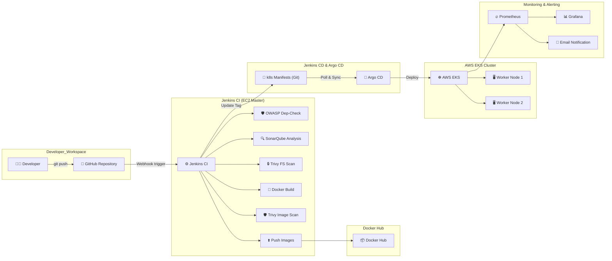

# Architecture Documentation

## Overview

The **DevSecOps & GitOps Mega Project** is a production-style, end-to-end automated platform featuring:
- A full-stack application (**DevOps Task Manager**) with React frontend, Node.js/Express backend, and MongoDB database.
- Infrastructure as Code (IaC) powered by **Terraform** on AWS (VPC, Subnets, NAT Gateways, Security Groups, IAM Roles, EC2 Jenkins Master, and AWS EKS Managed Kubernetes Cluster).
- Continuous Integration & Security (CI/DevSecOps) via **Jenkins**, integrating **OWASP Dependency-Check**, **SonarQube**, and **Trivy** for shift-left vulnerability management.
- Continuous Deployment (CD/GitOps) via **Argo CD**, ensuring pull-based declarative synchronization between GitHub manifests and AWS EKS.
- Full-stack Observability using **Prometheus**, **Grafana**, and Alerting via email.

---

## High-Level Workflow Diagram (Mermaid)



---

## ASCII Architecture Overview

```
+------------------+         +------------------+         +-------------------------+
|    Developer     | --push->|      GitHub      | ------->|   Jenkins CI (EC2)      |
+------------------+         +------------------+         +-------------------------+
                                                                       |
       +---------------------------------------------------------------+
       |             |                    |                  |                  |
       v             v                    v                  v                  v
  +---------+   +----------+       +--------------+  +---------------+   +--------------+
  |  OWASP  |   |SonarQube |       | Trivy FS/Img |  | Docker Build  |   | Push Images  |
  +---------+   +----------+       +--------------+  +---------------+   +--------------+
                                                                                |
                                                                                v
                                                                        +---------------+
                                                                        |  Docker Hub   |
                                                                        +---------------+
                                                                                |
  +-------------------+        +-------------------+                            |
  |  AWS EKS Cluster  |<-------|      Argo CD      |<--- updates tag -----------+
  +-------------------+        +-------------------+
            |
            v
  +-------------------+        +-------------------+
  | Prometheus/Grafana| ------>| Email Notification|
  +-------------------+        +-------------------+
```
